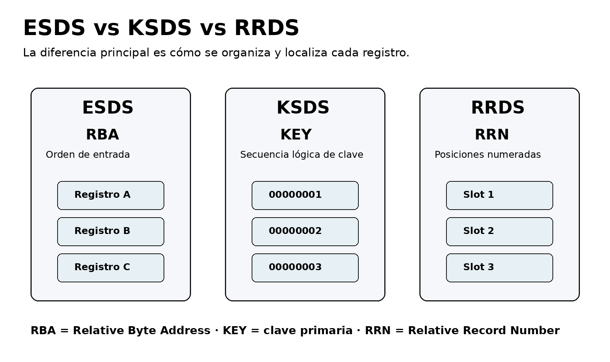
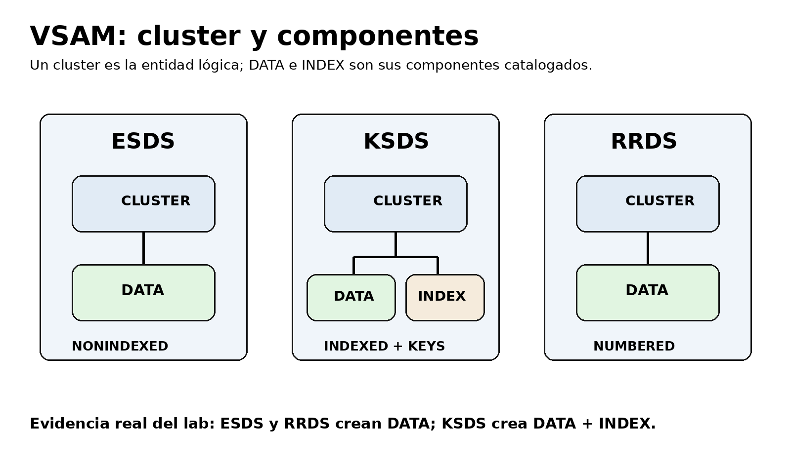
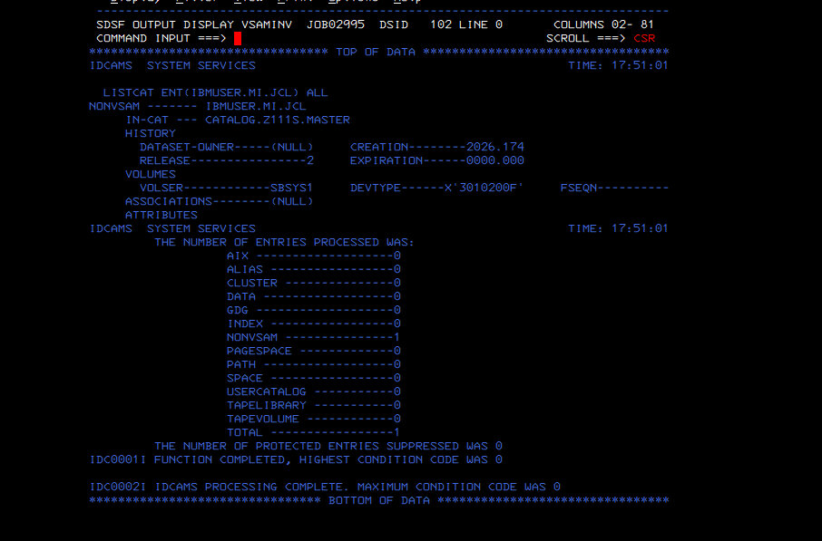
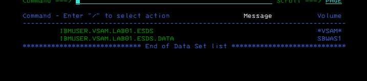
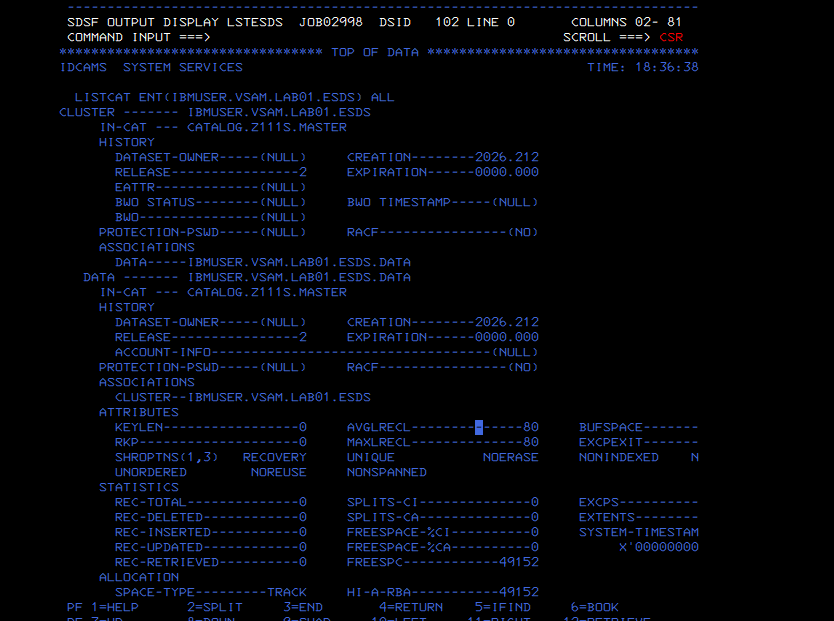
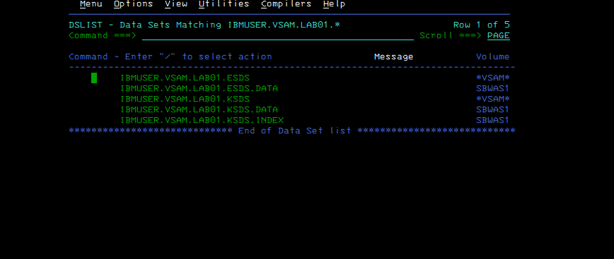
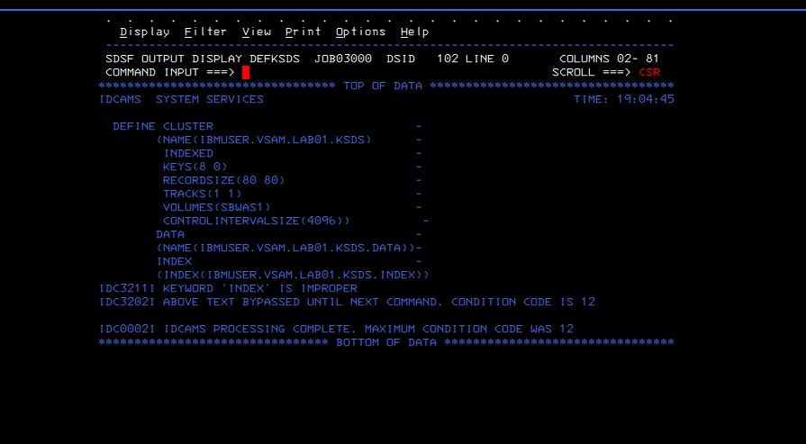
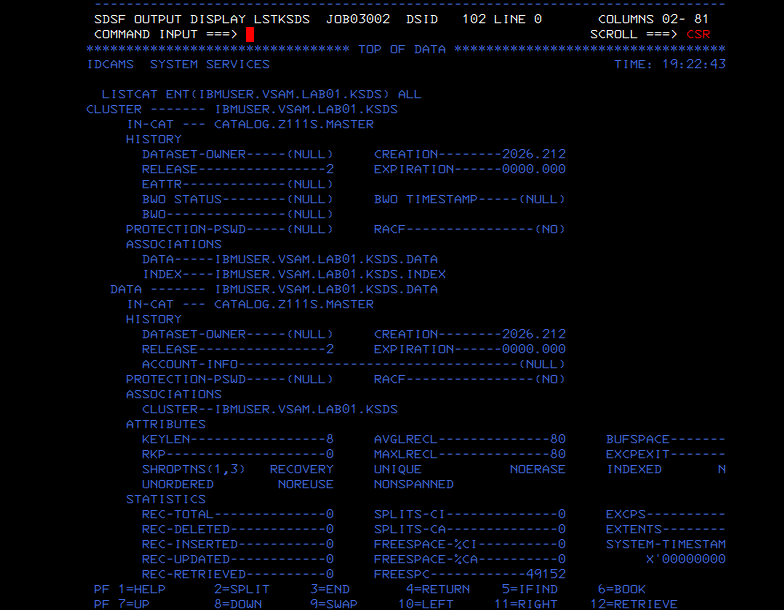
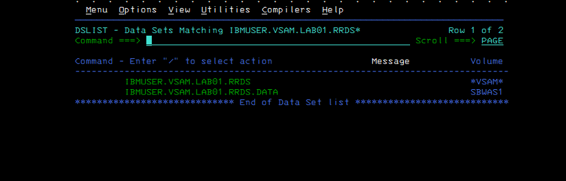
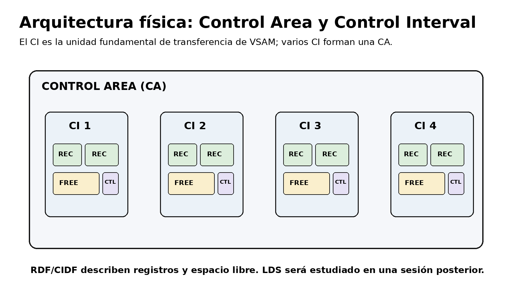

# VSAM01 — Fundamentos de VSAM: ESDS, KSDS y RRDS

## Objetivo

Construir una primera base práctica de administración VSAM en un sistema **IBM ADCD z/OS 1.11 sobre Hercules**, demostrando mediante IDCAMS, SDSF, ISPF y `LISTCAT` las diferencias entre:

- **ESDS** — Entry-Sequenced Data Set.
- **KSDS** — Key-Sequenced Data Set.
- **RRDS** — Relative Record Data Set.

El propósito no es limitarse a ejecutar `DEFINE CLUSTER`. El laboratorio documenta el inventario previo, la asignación física, las relaciones entre cluster y componentes, los atributos del catálogo, un error real de sintaxis y su corrección.



## Entorno

- Host: Windows.
- Emulador: Hercules.
- Sistema: IBM ADCD z/OS 1.11.
- Usuario: `IBMUSER`.
- Librería JCL: `IBMUSER.MI.JCL`.
- Utilidad: IDCAMS.
- Interfaces: ISPF 3.4 y SDSF.
- Volumen de trabajo: `SBWAS1`.
- Catálogo observado: `CATALOG.Z111S.MASTER`.

## Alcance

Este laboratorio completa:

1. Baseline de catálogo y prefijo.
2. Creación e inspección de un ESDS.
3. Creación e inspección de un KSDS.
4. Creación y verificación inicial de un RRDS.
5. Diagnóstico del error `IDC3211I KEYWORD 'INDEX' IS IMPROPER`.

Quedan expresamente pendientes para la siguiente sesión:

- `LISTCAT ALL` del RRDS.
- Creación y análisis de un LDS.
- Carga de registros mediante `REPRO`.
- Acceso por RBA, clave y RRN con datos reales.

## Arquitectura observada



```text
ESDS
└── DATA

KSDS
├── DATA
└── INDEX

RRDS
└── DATA
```

En ISPF, el cluster aparece como una entidad lógica `*VSAM*`; el volumen físico se asocia a sus componentes DATA e INDEX.

## Flujo ejecutado

```text
VSAMINV
   ↓
Baseline de IBMUSER.MI.JCL y prefijo IBMUSER.VSAM.*
   ↓
DEFESDS → LSTESDS
   ↓
DEFKSDS → error IDC3211I → corrección → LSTKSDS
   ↓
DEFRRDS
```

## 1. Inventario inicial

`VSAMINV` ejecutó una consulta de solo lectura:

```text
LISTCAT ENT(IBMUSER.MI.JCL) ALL
```

Resultado observado:

- `IBMUSER.MI.JCL` era una entrada `NONVSAM`.
- Catálogo: `CATALOG.Z111S.MASTER`.
- Volumen: `SBSYS1`.
- Condición final: `CC 0000`.
- El prefijo `IBMUSER.VSAM.*` no contenía datasets.

Esta fase evitó colisiones y proporcionó un baseline antes de modificar el catálogo.



## 2. Creación del ESDS

El ESDS se definió mediante:

```text
NONINDEXED
RECORDSIZE(80 80)
TRACKS(1 1)
VOLUMES(SBWAS1)
CONTROLINTERVALSIZE(4096)
```

Objetos creados:

```text
IBMUSER.VSAM.LAB01.ESDS
IBMUSER.VSAM.LAB01.ESDS.DATA
```

El cluster no tiene componente INDEX. Los registros se conservan en orden de entrada y pueden localizarse mediante RBA cuando la aplicación conoce dicha dirección.



## 3. Análisis del ESDS con LISTCAT

`LSTESDS` confirmó:

- `NONINDEXED`.
- `KEYLEN=0`.
- `AVGLRECL=80`.
- `MAXLRECL=80`.
- `REC-TOTAL=0`.
- `HI-U-RBA=0`.
- `HI-A-RBA=49152`.
- Volumen físico `SBWAS1`.
- Tamaño físico/CI observado de 4096 bytes.

La diferencia entre `HI-A-RBA` y `HI-U-RBA` muestra que el componente tenía espacio asignado, pero todavía no contenía registros.



## 4. Creación del KSDS

El KSDS se definió mediante:

```text
INDEXED
KEYS(8 0)
RECORDSIZE(80 80)
```

`KEYS(8 0)` indica:

- longitud de clave: 8 bytes;
- desplazamiento de la clave: byte 0;
- la clave ocupa las posiciones 0–7 del registro.

Objetos creados:

```text
IBMUSER.VSAM.LAB01.KSDS
IBMUSER.VSAM.LAB01.KSDS.DATA
IBMUSER.VSAM.LAB01.KSDS.INDEX
```



## 5. Incidencia real: IDC3211I

El primer intento de `DEFKSDS` finalizó con:

```text
IDC3211I KEYWORD 'INDEX' IS IMPROPER
IDC3202I ABOVE TEXT BYPASSED UNTIL NEXT COMMAND. CONDITION CODE IS 12
```

Causa:

```text
INDEX
  (INDEX(IBMUSER.VSAM.LAB01.KSDS.INDEX))
```

La palabra `INDEX` ya identificaba el componente. Dentro del bloque debía utilizarse el atributo `NAME`.

Corrección:

```text
INDEX
  (NAME(IBMUSER.VSAM.LAB01.KSDS.INDEX))
```

Tras la corrección, el job terminó con `CC 0000`.



## 6. Análisis del KSDS con LISTCAT

`LSTKSDS` permitió inspeccionar por separado:

- el cluster;
- el componente DATA;
- el componente INDEX.

El catálogo confirmó:

- `INDEXED`.
- `KEYLEN=8`.
- `RKP=0`.
- asociación con DATA e INDEX;
- asignación independiente para cada componente;
- ambos componentes inicialmente vacíos;
- residencia física en `SBWAS1`.



## 7. Creación del RRDS

El RRDS se definió mediante:

```text
NUMBERED
RECORDSIZE(80 80)
```

Objetos creados:

```text
IBMUSER.VSAM.LAB01.RRDS
IBMUSER.VSAM.LAB01.RRDS.DATA
```

El RRDS fijo organiza el espacio en slots y utiliza el **Relative Record Number (RRN)** como argumento de acceso. No crea componente INDEX.



## Comparación final

| Organización | Orden / identificación | Acceso característico | DATA | INDEX |
|---|---|---|---:|---:|
| ESDS | Orden de entrada | RBA | Sí | No |
| KSDS | Secuencia lógica de clave | Clave primaria | Sí | Sí |
| RRDS | Slots numerados | RRN | Sí | No |

## Control Area y Control Interval



El laboratorio utilizó `CONTROLINTERVALSIZE(4096)` para mantener una base homogénea. Un Control Interval contiene registros, espacio disponible y campos de control. Varios CI forman una Control Area.

## Resultados

- Baseline ejecutado con `CC 0000`.
- ESDS creado e inspeccionado.
- KSDS creado e inspeccionado.
- RRDS creado y visible en ISPF.
- Error real `IDC3211I` diagnosticado y corregido.
- Cluster y componentes diferenciados visualmente.
- Evidencias reales conservadas en `evidence/screenshots/`.
- Diagramas propios conservados en `evidence/diagrams/`.

## Seguridad operacional

- Se utilizaron exclusivamente nombres bajo `IBMUSER.VSAM.LAB01.*`.
- Los clusters se asignaron al volumen de trabajo `SBWAS1`.
- No se modificaron datasets `SYS1.*`, `ADCD.*`, catálogos del sistema ni clusters de producto.
- El rollback incluido elimina únicamente los tres clusters creados por este laboratorio.
- Antes de ejecutar el rollback debe comprobarse que ningún proceso mantiene los datasets abiertos.

## Estructura

```text
vsam01/
├── README.md
├── docs/
├── evidence/
│   ├── diagrams/
│   ├── output/
│   └── screenshots/
├── jcl/
├── ops/
├── references/
└── rollback/
```

## Valor profesional

El laboratorio demuestra capacidad para:

- trabajar con IDCAMS;
- interpretar catálogo y componentes VSAM;
- diferenciar ESDS, KSDS y RRDS;
- analizar `LISTCAT ALL`;
- interpretar atributos como `KEYLEN`, `RKP`, `HI-A-RBA` y `HI-U-RBA`;
- diagnosticar sintaxis IDCAMS mediante mensajes reales;
- mantener evidencias de SDSF e ISPF;
- operar de forma controlada sobre un entorno z/OS de laboratorio.

## Referencia técnica

- IBM Redbooks, **VSAM Demystified**, SG24-6105-02, Third Edition, August 2022.
